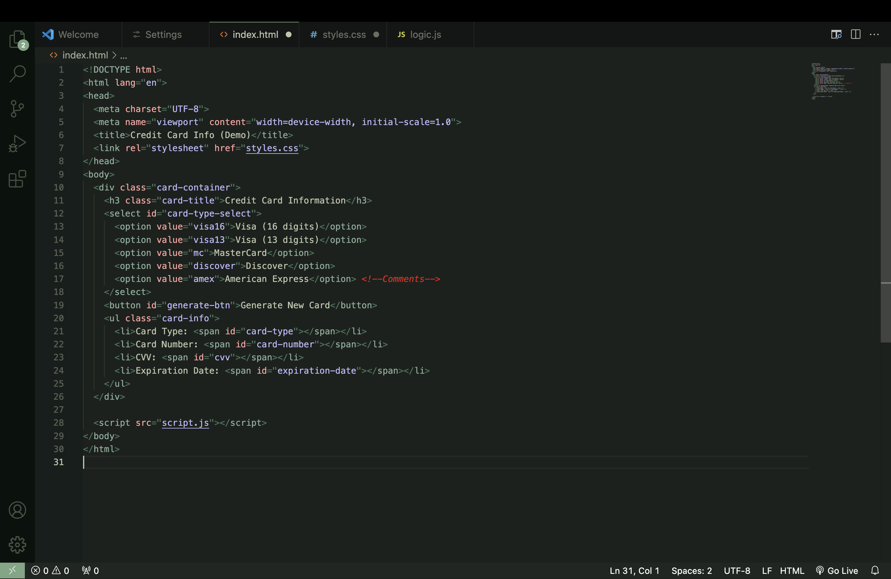
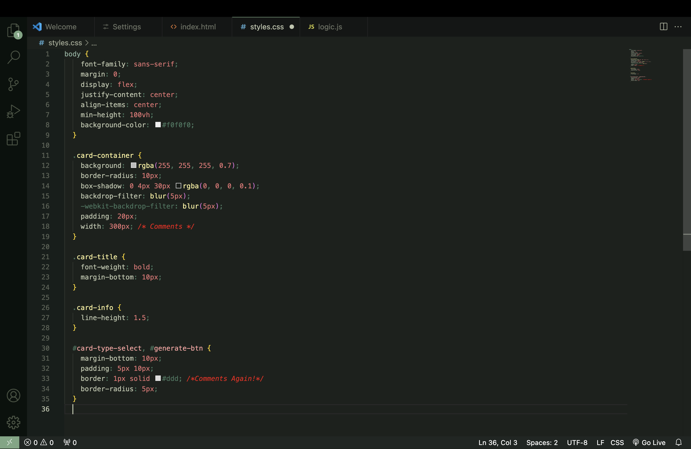
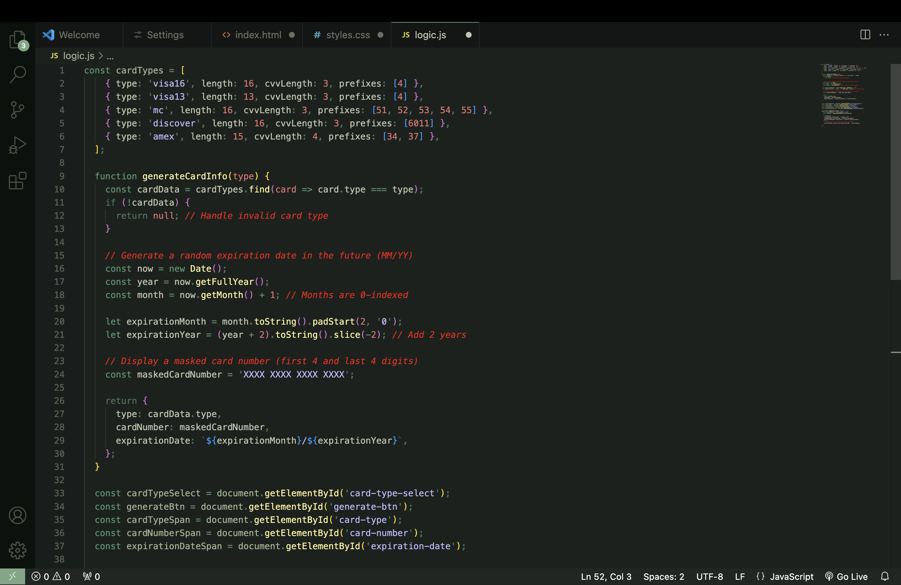

# Earthy Jewels
### *A visually pleasing dark theme with natural tones, colorful accents, and a calming code environment for VSCode.*

A [Visual Studio Code](https://code.visualstudio.com/) theme crafted for nocturnal coders, drawing inspiration from the serene hues of earthy jewels. Tailored for late-night coding sessions and low-light environments, this theme offers a soothing, green calm vibe, meticulously designed to enhance reading comprehension and foster focus.

Link to Marketplace: (https://marketplace.visualstudio.com/items?itemName=ShwetangshuB.earthy-jewels)

**HTML**

**CSS**

**JavaScript**

## Installation
1. Install [Visual Studio Code](https://code.visualstudio.com/).
2. Launch Visual Studio Code.
3. Click on **Extensions** tab in the Activity bar.
4. Search for **Earthy Jewels**.
5. Click **Install** to install the theme.
6. **Reload** Visual Studio Code.
7. Open the **Settings** menu.
8. Click: Color Theme > Earthy Jewels.

## Issues
- [Bug report]()
- [Feature request]()

## License
[MIT License](https://marketplace.visualstudio.com/items/dasShounak.noc/license)
